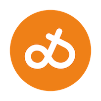

Hi! I'm Dimitrios, an engineering leader based in Gothenburg, Sweden.

I have spent the past fifteen years building software for clinical personnel and patients. The journey started with a PhD in Biomechanics, ran through aerospace engineering, and eventually brought me to where I have been ever since: at the intersection of software and healthcare.

---

I currently work as Development Manager at [Omda](https://omda.com/), leading development of Electronic Health Record systems used daily by clinical personnel across the Nordics. Before that I spent five years at [Mentice](http://www.mentice.com/) building VR simulation software for endovascular procedures, worked as Innovation Manager inside [Sahlgrenska University Hospital](https://www.sahlgrenska.se/en/), and led the Cloud Integrations team at [Glooko](https://glooko.com/) as Product Owner. I care about how teams work, how software gets built, and how it serves its end users.

---

I also write. [When Code Meets Care](https://dqsis.substack.com/) is my publication on software engineering in regulated healthcare: where clinical reality, engineering discipline, and organizational complexity meet.

---

I have [a beautiful wife](https://twitter.com/kalliopierripi) and two incredible daughters. 

I enjoy a variety of free-time activities, ranging from electric guitar to 3D printing. However, I spend most of my free time practicing endurance sports. I started swimming when I was six, and have not stopped since then. But I am also a cyclist and a runner. In 2014 I rode Mont Ventoux, in 2015 Passo dello Stelvio, and in 2022 Alpe d’Huez. In 2021 I ran for the first time the [Athens Marathon](https://www.athensauthenticmarathon.gr/site/index.php/en/) in 4hrs33min, which I did again (together with my wife this time) in 2023. Recently I also (re)discovered [strength training](https://github.com/dqsis/dqsis.github.io/blob/main/Training.md), which I practice 3 times per week. 

I try to read [2 to 3 books per month](https://www.goodreads.com/review/list/58873133-dimitrios-kiousis?shelf=read). My favorite possession is my [Honda Monkey](https://photos.app.goo.gl/evcdJG2P9QxK2cpy6) which I bought in March 2022.

---

Find me on [LinkedIn](https://www.linkedin.com/in/kiousis/) for more on my career.

