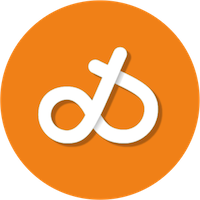

# Welcome 
Hi! And welcome to my digital [home](http://dqsis.com). My name is Dimitrios. 

## Table of Contents
- [About me](#about-me)
    - [Studies](#studies)
    - [Work](#work)
    - [Personal information](#personal-information-and-interests)
- [Contact me](#contact-me) 

## About me
I have spent the past fifteen years working at the crossroads of healthcare and technology, helping teams design and build digital health solutions for clinical professionals. I’m passionate about software development and enjoy using Agile principles to turn ideas into products.

### Studies 
I studied [Mechanical Engineering](http://www.mech.ntua.gr/en) at the National Technical University of Athens. At the age of 23, my interest for mathematics and [programming](http://web.stanford.edu/class/me200c/tutorial_77/) -and my curiosity to live abroad- brought me to Graz, Austria, where I did research on [angioplasty and stents](https://diglib.tugraz.at/biomechanical-and-computational-modeling-of-atherosclerotic-arteries-2008-4).
### Work
In 2008 I came to the west coast of Sweden and worked on designing [rocket](https://www.arianespace.com/vehicle/ariane-6/) and [jet](https://en.wikipedia.org/wiki/Pratt_%26_Whitney_PW1000G) engines to withstand thermo-mechanical fatigue.

In 2013 I moved to Gothenburg, where, for 3.5 years, I worked as a Consultant Manager in the field of Virtual Product Development. During that time I had the possibility to experience several highly technological branches ranging from Automotive to Packaging.  

Directly afterwards (in January 2017), I joined Mentice where, for 5 years, me and my team of Project Managers lead the development of [Virtual Reality simulation software](http://www.mentice.com/), within the fields of endovascular intervention and minimally invasive surgery.

Between August 2022 and January 2024 I worked as an Innovation Manager at the [Region of Västra Götaland](https://www.vgregion.se/ov/innovationsplattformen/) and at [Sahlgrenska University Hospital](https://www.sahlgrenska.se/en/). My primary focus was the collaboration between the public healthcare sector and the private industry sector. I also served as Innovation coach for a series of projects driven by clinical personnel within the region.

In 2024, I served as Product Owner at [Glooko](https://glooko.com/), leading the Cloud Integrations team. I was thrilled to work on a cutting-edge digital health platform that unified data from many of the leading diabetes devices, delivering insights that improved personal and clinical decision support.

In 2025 I began a new personal and professional chapter in Norway. My family and I moved to Oslo, where I joined [Omda](https://omda.com/) as Development Manager in the [Woman & Child Business Area](https://omda.com/solutions/woman-child/). Despite the re-location, the mission has always been the same: harness the power of technology to make healthcare more accessible, efficient, and impactful—right from the earliest moments of life.

Check my [LinkedIn profile](https://www.linkedin.com/in/kiousis/) for more information about my career.  
### Personal information and interests
I have [a beautiful wife](https://twitter.com/kalliopierripi) and two incredible daughters.

I enjoy a variety of free-time activities, ranging from electric guitar to 3D printing. However, I spend most of my free time practicing endurance sports. I started swimming when I was six, and have not stopped since then. But I am also a cyclist and a runner. In 2014 I rode Mont Ventoux, in 2015 Passo dello Stelvio, and in 2022 Alpe d’Huez. In 2021 I ran for the first time the [Athens Marathon](https://www.athensauthenticmarathon.gr/site/index.php/en/) in 4hrs33min, which I did again (together with my wife this time) in 2023. Recently I also (re)discovered [strength training](https://github.com/dqsis/dqsis.github.io/blob/main/Training.md), which I practice 3 times per week. 

I try to read [2 to 3 books per month](https://www.goodreads.com/review/list/58873133-dimitrios-kiousis?shelf=read). My favorite possession is my [Honda Monkey](https://photos.app.goo.gl/evcdJG2P9QxK2cpy6) which I bought in March 2022.

## Contact me
Do you have a question, need my help or just want to say hi? Reach out through one of my social media profiles:
- [Substack](https://substack.com/@dqsis)
- [Linkedin](https://www.linkedin.com/in/kiousis/)
- [Instagram ](https://www.instagram.com/dqsis)
